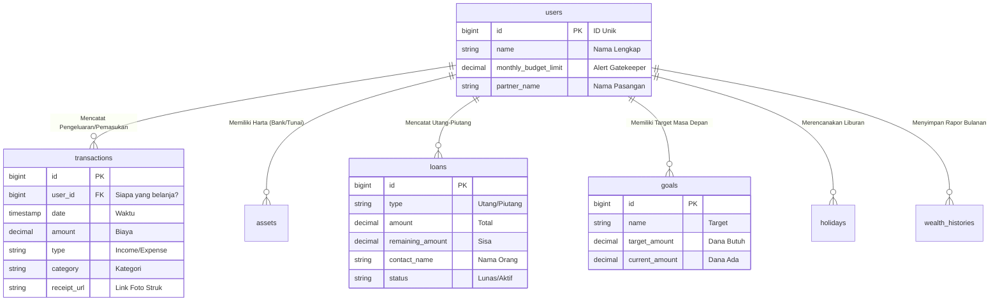

# 💰 Dompet Kita: Panduan Lengkap Struktur Data

Dokumen ini adalah panduan tunggal untuk memahami bagaimana sistem kita menyimpan informasi keuangan Alvin & Ila, mulai dari penjelasan sederhana hingga detail teknis database.

---

## 📗 BAGIAN 1: Panduan Sederhana (Bahasa Awam)

Jika dibayangkan sebagai buku catatan fisik di rumah, database kita terdiri dari beberapa **"Buku Catatan"** yang saling bekerja sama secara otomatis.

### 👤 1. Buku Profil (Users)

Ini adalah halaman pertama yang mencatat **siapa pemilik aplikasi ini**. Di sini tersimpan nama Alvin & Ila serta **"Batas Jajan Bulanan"** agar aplikasi bisa mengingatkan jika kita terlalu boros.

### 📝 2. Buku Kas Utama (Transactions)

Setiap kali ada uang masuk atau keluar, dicatat di sini. Lengkap dengan kategori (Makan, Transport, dll) dan foto struknya agar bukti bayar tidak hilang.

### 🏦 3. Daftar Harta (Assets)

Rangkap kekayaan kita ada di mana saja—mulai dari saldo di Bank, uang tunai di Dompet, hingga nilai Investasi kita.

### 🤝 4. Catatan Janji (Loans)

Mencatat urusan utang (kita pinjam) dan piutang (orang pinjam ke kita) agar tidak terlupakan.

### 🎯 5. Tabungan Mimpi & Liburan (Goals & Holidays)

Celengan digital khusus untuk rencana masa depan seperti beli barang impian atau rencana jalan-jalan ke luar kota/negeri.

---

## 🗄️ BAGIAN 2: Detail Teknis & Skema Database

Bagian ini merinci bagaimana setiap tabel di atas terhubung secara teknis di dalam sistem database PostgreSQL (Supabase).

### 🗺️ Peta Hubungan Data (ERD)

### 🔍 Bedah Fitur Canggih

- **Gatekeeper AI:** Menggunakan `monthly_budget_limit` di tabel `users` sebagai acuan untuk memberikan saran finansial di Dashboard.
- **Smart Loans:** Berkat kolom `remaining_amount`, sistem akan tahu kapan sebuah utang benar-benar lunas tanpa perlu kita hitung manual.
- **Keamanan Data (Cascade):** Jika akun ditutup, sistem secara otomatis akan menghapus seluruh data terkait demi menjaga privasi Anda berdua.

---

> [!TIP]
> **Filosofi Sistem:**
> Semua data terpusat dan terikat pada profil Anda. Transaksi yang Anda catat akan otomatis memengaruhi saldo aset dan progres tabungan mimpi Anda. Cerdas, rapi, dan transparan. ✨
