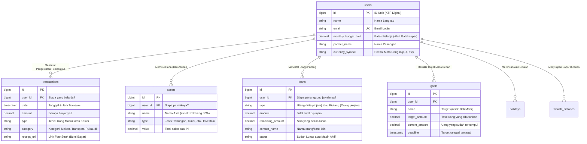

# 🗄️ Penjelasan Detail: Struktur Skema Database "Dompet Kita"

Dokumen ini menjelaskan bagaimana setiap bagian dari data kita saling terhubung dan apa fungsinya secara mendalam.

---

## 🗺️ Peta Hubungan Data (ERD)

Diagram di bawah ini menunjukkan bagaimana satu informasi (seperti Profil Pengguna) terhubung ke informasi lainnya (seperti Catatan Belanja atau Tabungan).

---

## 🔍 Penjelasan Detail Per Bagian

### 👤 1. Tabel `users` (Pusat Kendali)
Tabel ini bukan hanya untuk login, tapi juga sebagai **otak dari Gatekeeper (AI)**.
*   **monthly_budget_limit:** Ini adalah "polisi" digital kita. Jika total belanja di tabel `transactions` melebihi angka ini, AI akan memberikan peringatan.
*   **partner_name:** Memungkinkan aplikasi menyapa kita dan pasangan secara personal ("Halo Alvin, sampaikan salam ke Ila!").

### 💸 2. Tabel `transactions` (Buku Kas Harian)
Setiap transaksi yang kita masukkan tidak akan pernah hilang.
*   **user_id (Hubungan):** Menghubungkan belanjaan ke profil kita. Ini penting agar pengeluaran Alvin tidak bercampur dengan pengeluaran Ila (kecuali jika diinginkan).
*   **receipt_url:** Bukan sekadar teks, ini adalah alamat foto bukti bayar yang disimpan di awan (Cloud Storage). Jadi kalau struk kertasnya hilang, kita tetap punya buktinya.

### 🏦 3. Tabel `assets` (Gudang Kekayaan)
Menjelaskan **di mana** sebenarnya posisi uang kita.
*   **value:** Setiap kali kita melakukan transaksi di tabel `transactions`, angka di sini seharusnya diupdate agar mencerminkan saldo asli di bank atau dompet.

### 🤝 4. Tabel `loans` (Manajemen Utang)
Dibuat agar kita selalu ingat kewajiban kita atau tagihan orang lain.
*   **remaining_amount:** Kolom paling krusial. Ini otomatis mengecil setiap kali kita mencatat pembayaran utang. Status akan otomatis berubah menjadi `paid` (lunas) jika angkanya sudah nol.

### 🎯 5. Tabel `goals` & `holidays` (Mesin Waktu)
Berfungsi untuk memproyeksikan masa depan.
*   **target_amount vs current_amount:** Dua kolom ini adalah mesin penggerak "Progress Bar" di HP kita. Semakin mendekati angka target, bar akan semakin penuh dan berwarna cerah.

---

> [!IMPORTANT]
> **Keamanan Data (Cascade):**
> Semua data (belanjaan, tabungan, utang) terikat kuat ke ID Pengguna. Jika akun ditutup, semua data terkait akan dihapus secara otomatis demi privasi (ini disebut sistem *OnDelete Cascade*).
